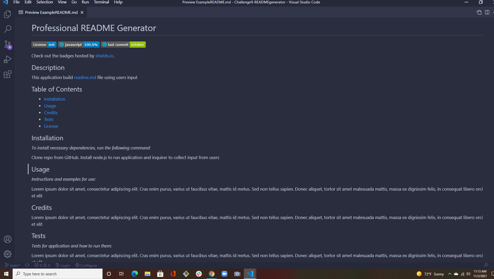

# Professional README Generator Starter Code

[How to create a Professional README](./readme-guide.md)
[Screencastify]()

# Professional README Generator

 
  
  
  
  
 

  ## Description

   This application generates readme.md file using users input.

  ## Table of Contents 
 * [Installation](#installation) 
 * [Usage](#usage) 
 * [Demo](#demo)
 * [License](#license)

  ## Installation 

  *To install necessary dependencies, run the following command:*
  
  * Clone repo from GitHub.Download node.js to run application, and inquirer for  collecting input from  the users.

  ## Usage

    
  *Instructions and examples for use:*
    
 * The application will be invoked by using `node index.js`

 * [View walkthrough video on Screencastify](https://watch.screencastify.com/v/t43xpEWSdhSSCjyEqXHK) 

 * [Professional README Generator - Repo](https://github.com/Tari-Star/Challenge9-READMEgenerator.git)

 

  ## Demo

  > Part 1

  

  > Part 2

  

  ## License

    
  > This project is licensed under the [mit](https://choosealicense.com/licenses/mit) license.
    
    
  
   ---
   
  ## Questions?

   
  
  
  For any questions, please contact me with the information below:
 
  GitHub: [@Tari-Star](https://api.github.com/users/Tari-Star)
   